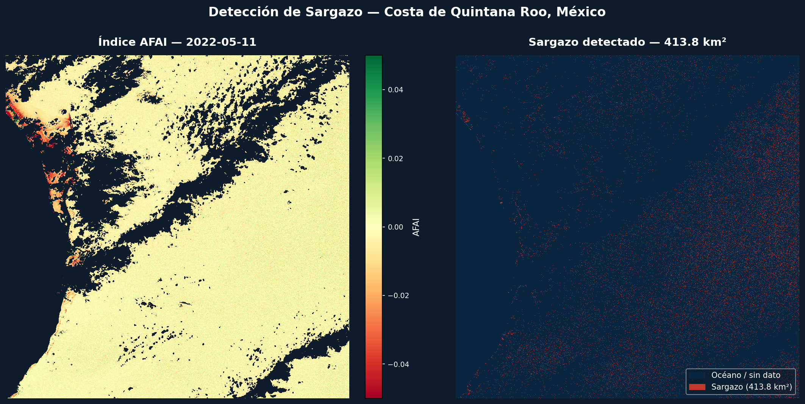
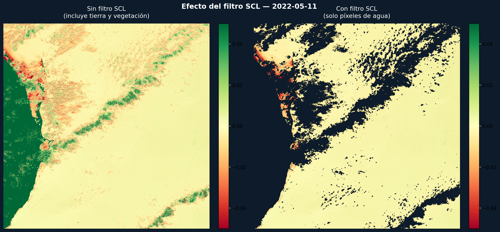

# Sargazo Detector

Detección de sargazo en costas yucatecas con imágenes del satélite Sentinel-2.  
 — Ingeniería en Computación, UADY 2026.


---

El proyecto implementa el índice AFAI sobre imágenes reales de la ESA para
detectar manchas de sargazo flotante en el Caribe mexicano. El 11 de mayo
de 2022 se detectaron **413.8 km²** frente a las costas de Quintana Roo.





---

## Cómo correrlo
```bash
conda activate sargazo
python test_afai.py
```

Algoritmo
```
AFAI = B8A − [B04 + (B11 − B04) × (865−665)/(1610−665)]
```

- **B04** — Banda roja (665 nm)
- **B8A** — Infrarrojo cercano (865 nm)  
- **B11** — Infrarrojo de onda corta (1610 nm)

Referencia: Wang & Hu, 2009 — *Remote Sensing of Environment*

## Stack

`rasterio` · `numpy` · `scikit-image` · `matplotlib` · `folium`

---

Alexander Gallegos · Facultad de Matemáticas UADY
